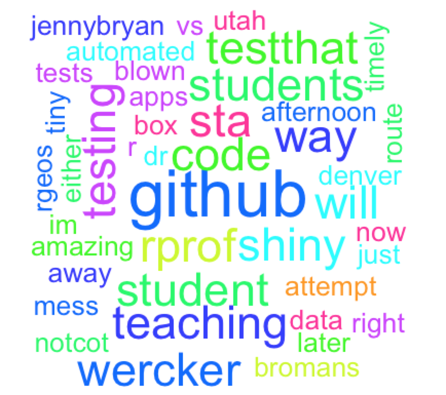

# Twitter Mysteries User Manual #

The goal of our final project is a text mining for the twitter.

## List of Packages for the Final Project 

`load_packages.R`


## Stage 0: Load the Package

Before the anaysis, you need load the packages that are in the file `load_packages.R`.

```{r}
## Now we load the packages
EnsurePackage<-function(x)
{x <- as.character(x)
if (!require(x,character.only=TRUE))
{
  install.packages(pkgs=x,repos="http://cran.r-project.org")
  require(x,character.only=TRUE)
}
}

#Identifying packages required 
PrepareTwitter<-function()
{
  EnsurePackage("httr")
  EnsurePackage("devtools")
  EnsurePackage("twitteR")
  EnsurePackage("base64enc")
  EnsurePackage("stringr")
  EnsurePackage("ROAuth")
  EnsurePackage("RCurl")
  EnsurePackage("ggplot2")
  EnsurePackage("tm")
  EnsurePackage("RJSONIO")
  EnsurePackage("wordcloud")
  EnsurePackage("ggplot2") 
  EnsurePackage("streamR")
  EnsurePackage("NYU160J")
  EnsurePackage("grid")
}

PrepareTwitter()
```
## Introduction (Basic Functionality)
Our final project consists of programming an R Shiny application that performs various types of analysis on data from Twitter. Users will choose between a particular topic (or in Twitter terms, hasthags #) or a specific Twitter handle. If a topic is chosen then the user can write whatever topic comes to mind which also exists on Twitter. The app will then collect a user-selected amount of random tweets associated with that hashtag in order to build a set of words to analyze or display. Conversely, if a handle is selected then the user can write out the exact handle and the app will again collect a particular amount (set by the user, or however many tweets that handle has if less than the specified number) of the most recent tweets to analyze. After the topic or handle have been selected, the app will run world cloud, word frequency association & clustering algorihms. The specifics of these will be discused separately alongside with the options available to the user.

## Scraping from Twitter


## Word Cloud

The word cloud is analyzed by usring the `twitterR` package. The goal of this section is to create a visualization of the most frequent vocab associated with the user's input string. For example, if the user enters "Christmas", this part will collect all the twitts that are associated with the "Christmas", retrun the frequncy of the vocab that are associated with "Christmas" and display the word clout. 

First, we need set up the authorization for the `twitterR` by giving the consumer_key, consumer_secret, access_token and all other authorization information.

```{r, eval=FALSE}
consumer_key<-"zSeAWHNpaL5G7GpHuCO4zTffT"
consumer_secret<-"dZnarPgWiQCnb1bJ0tvN3xFBmWVMRQCDDWl9UsFtkiTGpzztfG"
access_token<-"1071126529-DLvrKbaT9ju1yQsAHBWZz5h3vHGEWWyWYeTHP4Z" 
access_secret<-"h3XgPKhsKkF66ShXfbFPEnby2VUofGD6AYvu53CFvUFX7" 
requestURL <- "https://api.twitter.com/oauth/request_token"
accessURL <- "https://api.twitter.com/oauth/access_token"
authURL <- "https://api.twitter.com/oauth/authorize"

setup_twitter_oauth(consumer_key, consumer_secret, access_token,access_secret)
```

The user will interact with the `twitterR` by entering the string, **rundel**, that he is interested in to know the most frequent vocab that are assocaited with it.

```{r, eval=FALSE}
tweets = userTimeline("rundel",n = 1000)
```

All the twitts are treated as a whole. The `tm_map` will be applied to clean out the the text by removing punctuations, selecting preferred languages, excluding certain pattern of the words and setting up the stop words. 

```{r, eval=FALSE}
removeURL = function(x) gsub("http[[:alnum:]]*", "", x)
myStopwords = c(stopwords("english"), "isis","rt","amp","twitter", "tweets", "tweet", "retweet", "tweeting", "account", "via", "cc", "ht")

myCorpus = Corpus(VectorSource(tweets.df$text)) %>%
           tm_map(content_transformer(tolower)) %>%
           tm_map(content_transformer(removePunctuation)) %>%
           tm_map(content_transformer(removeNumbers)) %>% 
           tm_map(content_transformer(removeURL)) %>%
           tm_map(removeWords, myStopwords) %>% 
           tm_map(content_transformer(stemDocument))

```

The cleaned out words will be look like:

```{r, eval=FALSE}
[[1]]winstonchang will  im personally blown away   nicely  works  shiny apps right    box  rprof   mess  
[[2]]winstonchang amazing work   timely  well saves     teach  students  rprof later  afternoon
[[3]]just   attempt teaching shiny  parallel programming  r  way  bromans socks  rabaaths tiny data
[[4]]perfect timing  teaching sta students  preserving vs simplifying subsetting today 
[[5]] automated testing  student rstats code  github  wercker  now  testthat 
```

`TermDocumentMatrix` is applied to analyze the term frequency. The outpul will be treated as a matrix. The row name is the vocab and the colum list the number of times it appears in the document. 

```{r, eval=FALSE}
tdm <- TermDocumentMatrix(myCorpus, control = list(wordLengths = c(1, Inf)))
m = as.matrix(tdm)
```
  
The word cloud is generated by the package `wordCloud`. The ordered vocab in terms of the frequency will be passsed into the `wordcloud`.

```{r, eval=FALSE}
word.freq = sort(rowSums(m), decreasing = T)
wordcloud(words = names(word.freq),random.color = TRUE, colors=rainbow(10), freq = word.freq, min.freq = 10, random.order = F)
```

Here is an example of the word cloud associated with key words: *rundel*



## Word Frequency Association

Word Associations plot provides a visualization of word association in the tweeter we just parsed from a particular subject of interest. And we can use the "tm" package to perform word association analysis. We also provide customized choice for user to select whether they want to show words to be associated with a particular word they are interested in.

First, by creating a Term Document Matrix using "tm" packages, we find further use the function to find the frequent words with minimum frequency, in this example, the minimum frequency is 50.

Then we use "Rgraphviz" packages that allows us to plot the word association map with weighting as well as provides a better visualization of relationship between words.

```{r}
tdm <- TermDocumentMatrix(myCorpus, control = list(wordLengths = c(1, Inf)))
m = as.matrix(tdm)
freq.terms <- findFreqTerms(tdm, lowfreq=50)
suppressMessages(library(graph))
suppressMessages(library(Rgraphviz))
plot(tdm, term = freq.terms, corThreshold = 0.12, weighting = T)
```

In order to add more friendly element to our app, we also create a dataframe that allows the user the choose a particular word they are most interested and see what other words this word can be asscioated with the minimun correlation equals 0.25.

```{r}
findAssocs(tdm, "r", 0.25)
```

In the shiny app, we create the above plot with corresponding syntax in shiny.

```{r,eval=FALSE}
tdm = reactive ({
      TermDocumentMatrix(myCorpus(), control = list(wordLengths = c(1, Inf))) 
    })
    
    m = reactive ({
      as.matrix(tdm())
      })
    
#define the frequency terms
freq.terms = reactive ({
  if (input$content=="topic") {
    findFreqTerms(tdm(), lowfreq = input$n_tweets/25)
  } else {
    findFreqTerms(tdm(), lowfreq = 2)
  }
})

output$word_association= renderPlot({
      plot(tdm(), term = freq.terms(), corThreshold = 0.12, weighting = T)
    })

output$word_assc_table = renderTable({
      as.data.frame(findAssocs(tdm(), tolower(input$freq_word), input$coorelation))
})
    
```


## Clustering

Based on the data we collected, we use cluster analysis to divide them into several groups. The method we use is Ward's Method. This method start out with all sample units in n clusters of size 1 each. In the first step of the algorithm, n - 1 clusters are formed, one of size two and the remaining of size 1. The error sum of squares and r2 values are then computed. The pair of sample units that yield the smallest error sum of squares,  will form the first cluster. Then, in the second step of the algorithm, n - 2 clusters are formed from that n - 1 clusters defined in step 2. These may include two clusters of size 2, or a single cluster of size 3 including the two items clustered in step 1. Again, the value of r2 is maximized. Thus, at each step of the algorithm clusters or observations are combined in such a way as to minimize the results of error from the squares or alternatively maximize the r2 value. The algorithm stops when all sample units are combined into a single large cluster of size n .

In our apps, we let the user choose the cluster number and their interested topics. By running our clustering algorithm, the user is able to see the most relavent words regarding the topic s/he choosed before. What's more, the user is able to see how these words being clustered into k categories according to their distance.Words in red rectangular lines are clustered into one group which implies these words share the most closest distance comparing with other word groups. 

## Example Usage (Seen in our default app settings)
A trending topic in the news, and thus Twitter, is the terrorist organization ISIS. If our app runs this as the topic of interest, collecting 100 of latest related tweets we see that our world cloud contains very relevant terms such as terrorists, Obama, US, Syria, terrorism, terror. As we increase the number of tweets we can see some other terms with looser conections such as Russia,  Trump, passports, arrested, fighting are included. If we move to the Word Frequency association and try to use Obama as our key word to associate, words that have at least 0.5 correlation include stop, failure, exposes, turning which indicate quite neatly how divided the POTUS's action are amongst the community. Then as we move to the cluster dendogram option we can see that usual clusters involve Trump, ban (referencing Trump's recent anti-muslim remarks) or Obama and US, or just other words with violent connotations such as beating or escaping. Since the tweets are random and thius topic is popular (along with a fresh stream of tweets every hour), these exact results may not show up but the analysis was repeated various times and the most general results are being discussed.

On the other hand, we can try to search a specific Twitter handle. We chose our professor Colin Rundel's account and try to see any patterns with his tweets. With a max of 100 words in the cloud, the most popular word is github and the next few that follow are also terms related to things he has taught in 523 such as wercker, testthat, shiny, rgeos, hadleywickham. A word fequency association analysis shows that most of the words listed above are also very correlated. If we were to choose student, we see that testing and code have correlation of 1 so they are always paired together. rmd and rstats are also close with a correlation of 0.66. Finally, the cluster dendogram is very interesting here since we can toggle a different number of cluster quite nicely. Again studen, testig code are together but there is also a cluster with socks, parallel, programming, rabbaths & shiny which correctly refer to the SHiny-themed homework we had this semester. Hence we see that Professor Rundel's Twiiter is a great blueprint for his teaching style & assignments.

## Errors
Due to the random nature of many tweets and how very different ones can be grouped together by an specific topic or user, it could be the case that the app encounters some errors. For example, some users may not have many tweets and thus word association could be invalid. In addition, there may be a topic that doesn't has too many unique words and this overblows the capabilities of the clustering paramaeters. Issues like this may be solved by tuning the available options such as minimum frequency count or number of clusters to be set. We urge that a error screen does not mean the app cannot still work for other configurations.
